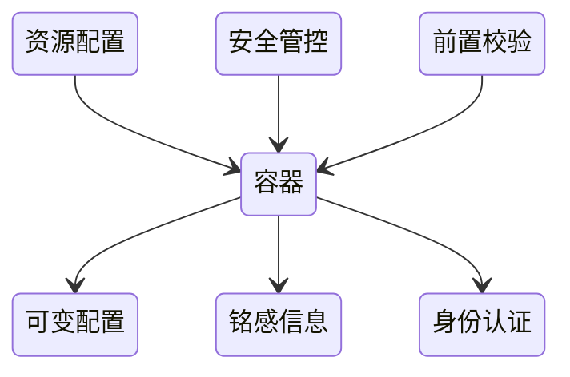

## 问题的背景


依托镜像定义运行的Container，Pod，还需要解决如下问题：

1. 不可变基础设施（容器）的可变配置
2. 敏感信息的存储和使用（如秘密，Token）
3. 集群中Pod自我的身份认证
4. 容器的运行安全管控
6. 容器启动前置条件校验



### POD的配置管理


## 配置文件详解

## ConfigMap

### ConfigMap 介绍

管理容器运行所需要的：
配置文件
环境变量
命令行参数
用于解耦，容器镜像和可变配置
保障 工作负载的可移植性


```
apiVersion: v1
kind ConfigMap
metadata:
    labels:
      app: flannel
      tier: node
    name: kube-flannel-cfg
    namespace: kube-system
data:
  cni-conf.json: {
    "name": "cbr0",
    "type": "flannel",
    "delegate": {
      "isDefaultGateway": true
    }
  }
  net-conf.json: {
    "Network":"172.27.0.0/16",
    "Backend": {
      "Type": "vxlan"
    }
  }
```


### ConfigMap 创建

创建命令： kubectl create configmap [NAME][DATA]

     kubectl create configmap kube-flannel-cfg --from-file=config-prod-container/configmap/cni-conf.json -n kube-system


### ConfigMap 使用


### ConfigMap 使用的注意事项


## Secrete 

### Secrete 介绍


### Secrete 创建


### Secrete 使用


### Secrete 注意事项


## ServiceAccount

### 应用场景


### 案例分析


## Resource

### 容器资源管理


### Pod(QoS)配置


## Security Context


## InitContainer

### InitContainer介绍

InitContainer 和普通 container 的区别：

1. InitContainer 首先会比普通 container 先启动，并且直到所有的 InitContainer 执行成功后，普通 container 才会被启动
2. InitContainer 之间是按定义的次序去启动执行的，执行成功一个之后再执行第二个，而普通的 container 是并发启动的
3. InitContainer 执行成功后就结束退出，而普通容器可能会一直在执行。它可能是一个 longtime 的，或者说失败了会重启，这个也是 InitContainer 和普通 container 不同的地方

### InitContainer 用途

用于普通Container启动前的初始化(如配置文件准备)或普通Container启动的前置条件检验
