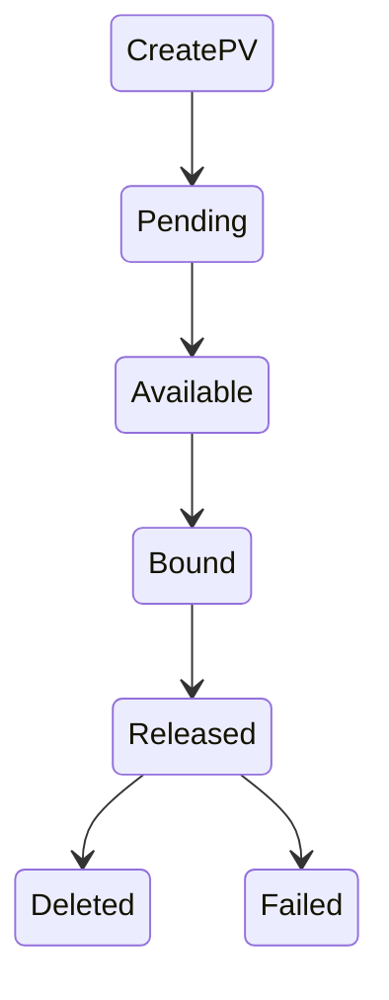

## 目标

1. k8s Volume 使用场景
2. PVC/PV/StorageClass 基本操作和概念呢解析
3. PVC/PV 设计与实现原理

## 存储基本概念介绍

### 术语表

| 术语  |  描述 |简称
|:------|:-------|:-------|
| Volumes | 存储卷 |V |
| Pod Volumes| Pod存储卷|PV|
| Persistent Volumes| 持久化卷|PV|
| PersistentVolumeClaim| 持久化存储卷申明|PVC|
| in-tree| 网络存储实现的代码在k8s仓库中|in-tree|
| out-of-tree| 网络存储实现, 通过从抽象接口将不通的存储  driver实现从k8s代码仓库中玻璃|out-of-tree|
|container storage interface| K8s社区后面对存储插件实现(out of tree)的官方推荐方式|CSI|

### 持久化存储的业务场景

1. 如果 pod 中的某一个容器在运行时异常退出，被 kubelet 重新拉起之后，如何保证之前容器产生的重要数据没有丢失？
2. 如果同一个 pod 中的多个容器想要共享数据，应该如何去做？

### Pod Volumes 的三种类型：

1. 本地存储，常用的有 emptydir/hostpath；
2. 网络存储：网络存储当前的实现方式有两种，一种是 in-tree，它的实现的代码是放在 K8s 代码仓库中的，随着k8s对存储类型支持的增多，这种方式会给k8s本身的维护和发展带来很大的负担；而第二种实现方式是 out-of-tree，它的实现其实是给 K8s 本身解耦的，通过抽象接口将不同存储的driver实现从k8s代码仓库中剥离，因此out-of-tree 是后面社区主推的一种实现网络存储插件的方式；
3. Projected Volumes：它其实是将一些配置信息，如 secret/configmap 用卷的形式挂载在容器中，让容器中的程序可以通过POSIX接口来访问配置数据；

### Pod Volumes 存在的问题

1. 场景一：pod 重建销毁，如用 Deployment 管理的 pod，在做镜像升级的过程中，会产生新的 pod并且删除旧的 pod ，那新旧 pod 之间如何复用数据？
2. 场景二：宿主机宕机的时候，要把上面的 pod 迁移，这个时候 StatefulSet 管理的 pod，其实已经实现了带卷迁移的语义。这时通过 Pod Volumes 显然是做不到的；
3. 场景三：多个 pod 之间，如果想要共享数据，应该如何去声明呢？我们知道，同一个 pod 中多个容器想共享数据，可以借助 Pod Volumes 来解决；当多个 pod 想共享数据时，Pod Volumes 就很难去表达这种语义；
4. 场景四：如果要想对数据卷做一些功能扩展性，如：snapshot、resize 这些功能，又应该如何去做呢？

### Pod Volumes 的解决方案- Persistent Volumes

将存储和计算分离，通过不同的组件来管理存储资源和计算资源，然后解耦 pod 和 Volume 之间生命周期的关联
。这样，当把 pod 删除之后，它使用的PV仍然存在，还可以被新建的 pod 复用。

###  Persistent Volumes 的接口描述 PVC

用户在使用持久化存储时，真正关心的问题是：
1. 使用的存储是可以被多个node共享还是只能单node独占访问(注意是node level而不是pod level)？
2. 只读还是读写访问？
而不关心，与存储相关的实现细节。
这就使得我们需要抽象一层接口层，屏蔽掉存储实现细节的信息。这就是PVC的来历

**为什么需要设计PVC?**

1. 职责分离。 

         PVX中只用声明自己需要的存储大小，access mode (单node独占还是多node 共享，只读还是
         读写访问？)等业务真正关系的存储需求，PV和其对应的后段存储信息则交给cluster admin
         统一运维和管控，安全访问策略更容易控制。
2. **PVC简化了User对存储的需求，PV才是存储实际信息的载体**

         通过kube-controller-manager中的PersistentVolumeController将PVC和合适的PV bound
         到一起，从而满足实际的存储需求
3. PVC类似接口，PV类似接口对应的实现

<!--  -->

###  PVC 和 PV的两种Bound 关系

正如前文分析，PV 和PVC 类似实现类和接口的关系，那么在实际中两者的关系就有静态绑定，和动态绑定两种
接下来，分析两种关系。 

#### Static Volume Provisioning (静态Bound)

实现过程
1. 由集群管理员（cluster admin）事先去规划这个集群中的用户会怎样使用存储，它会先预分配一些存储，也就是预先创建一些 PV；
2. 然后用户在提交自己的存储需求（也就是 PVC）的时候，K8s 内部相关组件会帮助它把 PVC 和 PV 做绑定；3. 用户再通过 pod 去使用存储的时候，就可以通过 PVC 找到相应的 PV

静态绑定的方式，
需要先设置好模版，对资源池的划分比较粗糙。

    举例：如果用户需要的是 20G，然而集群管理员在分配的时候可能有 80G 、100G 的，但没有 20G的，这样就很
    难满足用户的真实需求，也会造成资源浪费

#### Dynamic Provisioning(动态态Bound)

实现过程

1. 集群管理员不预先创建PV，而提供模版文件（StorageClass)

        StorageClass 表示创建某一类型存储（块存储，文件存储等）所需的一些参数。用户在提交自身存储需求
        (PVC)时，在PVC中指定使用的存储模版（StorageClass）
2. 集群中的管控组件，会结合 PVC 和 StorageClass 的信息, 动态的生成
用户所需的PV，将PVC和PV绑定后，Pod 即可以使用PV了。

       通过 StorageClass 配置生成存储所需要的存储模板，再结合用户的需求动态创建 PV 对象，做到按需分
       配，在没有增加用户使用难度的同时也解放了集群管理员的运维工作

## PVC/PV/StorageClass 基本操作和概念解析

### Pod Volumes 使用

1. 通过 .spec.volumes 申明pod 的 volumes 信息
2. 通过 .spec.containers.volumesMounts 申明 container
如何使用pod 的volumes 信息
3. 通过 .spec.containers.volumesMounts.subPath 隔离不通容器在同一个
volumes上数据存储的路径，实现多个container 共享同一个volumes

### Static Volume Provisioning 案例分析

1. Cluster Admin & User 

2. 管理员配置解析

2. 用户配置解析

### Dynamic Volume Provisioning 案例分析

1. 系统管理员

1.1 系统管理员不再预分配 PV，而只是创建一个模板文件 -- StorageClass

      StorageClass 的信息：
      第一：provisioner, 即那个存储插件。
          存储插件provisioner对应创建PV的具体实现
      第二：参数。
          k8s创建存储的时候，需要指定的一些细节参数。如：regionld、zoneld、fsType 和它的类型，
          ReclaimPolicy：使用方使用结束、Pod 及 PVC 被删除后，这块 PV 应该怎么处理

2. 用户如何用

2.1 PVC 新加一个字段-StorageClassName

2.2 用户提交完PVC之后，K8s 集群中的相关组件就会根据PVC以及StorageClass动态生成 PV,并和当前PVC绑定

2.3 之后用户在提交自己的 yaml 时，PVC找到PV，并把它挂载到相应的容器中

### PV Spec 重要字段解析

用户在提交PVC的时候,最重要的两个字段 —— Capacity 和 AccessModes。

*Capacity*: 存储对象的大小；
*AccessModes* : PV三种使用方式:
    1. 单 node 读写访问；
    2. 多个 node 只读访问，是常见的一种数据的共享方式；
    3. 多个 node 上读写访问。

在提交 PVC 后，k8s 集群中的相关组件是如何去找到合适的 PV 呢？

   1. 首先它是通过为 PV 建立的 AccessModes 索引找到所有能够满足用户的 PVC 里面的 AccessModes 要求的 PV list，
   2. 然后根据PVC的 Capacity，StorageClassName, Label Selector 进一步筛选 PV，
   3. 最小适合原则筛选
      如果满足条件的 PV 有多个，选择 PV 的 size 最小的，accessmodes 列表最短的 PV

在PV 使用完毕后如何释放回收？

*ReclaimPolicy*:常见的有二种方式:
1.  delete: PVC 被删除之后，PV 也会被删除；
2.  Retain: 就是保留，保留之后，后面这个 PV 需要管理员来手动处理。

StorageClassName：动态 Provisioning 时必须指定的一个字段,来指定到底用哪一个模板文件来生成 PV；

NodeAffinity：创建出来的PV，它能被哪些node去挂载使用，
    其实是有限制的。然后通过 NodeAffinity 来声明对node的限制，这样其实对 使用该PV的pod调度也有限制。
    pod 必须要调度到这些能访问 PV 的 node 上，才能使用这块 PV

### PV 状态图

解释：

1. 首先在创建PV对象后，它会处在短暂的pending 状态；
   等真正的 PV 创建好之后，它就处在 available 状态
2. 用户在提交 PVC 之后，被 K8s 相关组件做完 bound（即：找到相应的 PV），这个时候 PV 和 PVC 就结合到一起了，此时两者都处在 bound 状态
3. 在使用完 PVC，将其删除后，这个 PV 就处在 released 状态
4. 当 PV 已经处在 released 状态下，它是没有办法直接回到 available 状态
想把已经 released 的 PV 复用，有两种方式
4.1 新建一个 PV 对象，然后把之前的 released 的 PV 的相关字段的信息填到新的 PV 对象里面，这样的话，这个 PV 就可以结合新的 PVC 了
4.2 是我们在删除 pod 之后，不要去删除 PVC 对象，这样给 PV 绑定的 PVC 还是存在的，下次 pod 使用的时候，就可以直接通过 PVC 去复用

## PVC/PV 设计与实现原理

### 架构设计

#### Pod/PV 创建的流程

CSI(container storage interface) 的实现可分为两大部分：

* 第一部分是由k8s社区驱动实现的通用的部分，如图中 csi-provisioner和 csi-attacher controller；
* 第二部分由云存储厂商实践的，对接云存储厂商的 OpenApi，主要是实现真正的 create/delete/mount/unmount 存储的相关操作，对应到上图中的csi-controller-server和csi-node-server。

用户提交 yaml 之后，k8s内部的处理流程：

1. 用户在提交 PVCyaml 的时候，首先会在集群中生成一个 PVC 对象
2. PVC 对象会被 csi-provisioner controller watch到，csi-provisioner 会结合 PVC 对象以及 PVC 对象中声明的 storageClass，通过 GRPC 调用 csi-controller-server
3. csi-controller-server，然后，到云存储服务这边去创建真正的存储，并最终创建出来 PV 对象
4. 由集群中的 PV controller 将 PVC 和 PV 对象做 bound ， PV 就可以被使用了

5. 用户在提交 pod 之后,首先会被调度器调度选中某一个合适的node
6. 该 node 上面的 kubelet 在创建 pod 流程中会通过首先 csi-node-server 将我们之前创建的 PV 挂载到我们 pod 可以使用的路径
7. kubelet 开始  create && start pod 中的所有 container

#### PV、PVC 以及通过 csi 使用存储流程

有三个阶段：

第一:  create 阶段，主要是创建存储

     用户提交完 PVC，由 csi-provisioner 创建存储，并生成 PV 对象，之后 PV controller 将 PVC 及生
     成的 PV 对象做 bound
     
第二:  attach 阶段，就是将那块存储挂载到 node 上面(通常为将存储load到node的/dev下面)；

    用户在提交 pod yaml 的时候，首先会被调度选中某一个 合适的node，等 pod 的运行 node 被选出来之后，
    会被 AD Controller watch 到 pod 选中的 node，它会去查找 pod 中使用了哪些 PV。然后它会生成一
    个内部的对象叫 VolumeAttachment 对象，从而去触发 csi-attacher去调用csi-controller-server 
    去做真正的 attache 操作，attach操作调到云存储厂商OpenAPI。这个 attach 操作就是将存储 attach到 
    pod 将会运行的 node 上面

第三:  mount 阶段，将对应的存储进一步挂载到 pod 可以使用的路径

    kubelet 创建 pod的过程中，它在创建 pod 的过程中，首先要去做一个 mount，这里的 mount 操作是为了将
    已经attach到这个 node 上面那块盘，进一步 mount 到 pod 可以使用的一个具体路径，之后 kubelet 才
    开始创建并启动容器

## 总结

* 介绍了 K8s Volume 的使用场景，以及本身局限性；
* 通过介绍 K8s 的 PVC 和 PV 体系，说明 K8s 通过 PVC 和 PV 体系增强了 K8s Volumes 在多 Pod 共享/迁移/存储扩展等场景下的能力的必要性以及设计思想；
* 通过介绍 PV（存储）的不同供给模式 (static and dynamic)，学习了如何通过不同方式为集群中的 Pod 供给所需的存储；
* 通过 PVC&PV 在 K8s 中完整的处理流程，深入理解 PVC&PV 的工作原理。