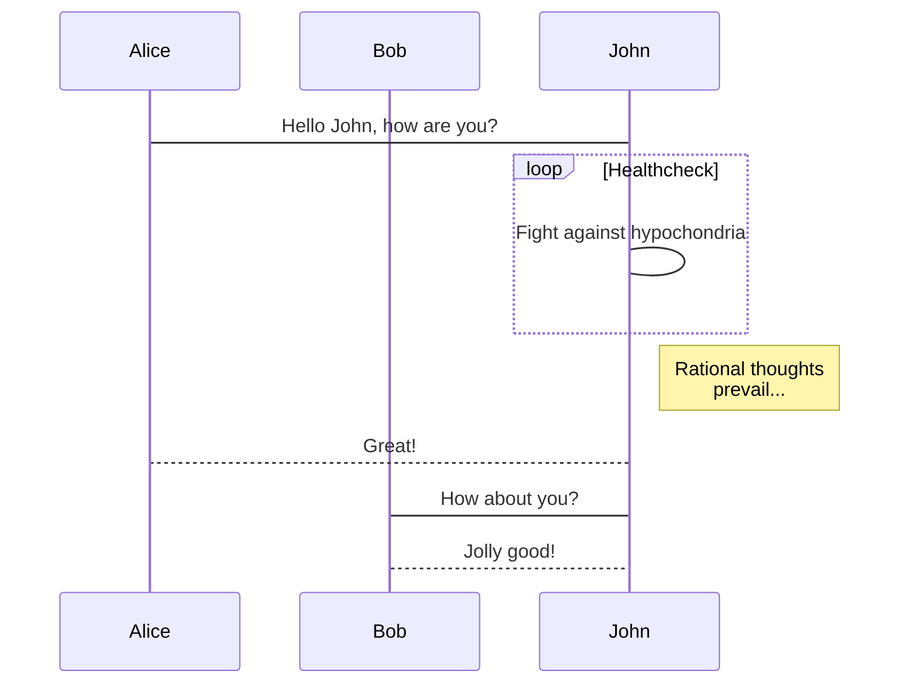
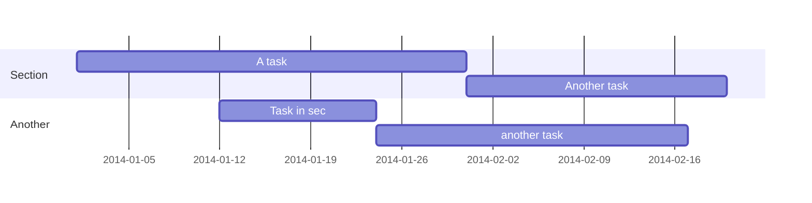

---
# Course title, summary, and position.
linktitle: 个人博客模版
summary: Blog Setup
weight: 1

# Page metadata.
title: 个人博客模版
date: "2018-09-09T00:00:00Z"
lastmod: "2018-09-09T00:00:00Z"
draft: false  # Is this a draft? true/false
toc: true  # Show table of contents? true/false
type: docs  # Do not modify.

# Add menu entry to sidebar.
# - name: Declare this menu item as a parent with ID `name`.
# - weight: Position of link in menu.
menu:
  Blog:
    name: 常用功能概览
    weight: 1
---

## 嵌入其它文档



## 表单

| Command           | Description                    |
| ------------------| ------------------------------ |
| `hugo`            | Build your website.            |
| `hugo serve -w`   | View your website.             |

## 数学公式

Example math block:

$$\gamma_{n} = \frac{ 
\left | \left (\mathbf x_{n} - \mathbf x_{n-1} \right )^T 
\left [\nabla F (\mathbf x_{n}) - \nabla F (\mathbf x_{n-1}) \right ] \right |}
{\left \|\nabla F(\mathbf{x}_{n}) - \nabla F(\mathbf{x}_{n-1}) \right \|^2}$$

$$f(k;p_0^*) = \begin{cases} p_0^* & \text{if }k=1, \\\\
1-p_0^* & \text {if }k=0.\end{cases}$$

$\nabla F(\mathbf{x}_{n})$

Example multi-line math using the \\\\ math linebreak:

$$f(k;p_0^*) = \begin{cases} p_0^* & \text{if }k=1, \\\\
1-p_0^* & \text {if }k=0.\end{cases}$$

## 嵌入外部文档

## 图

### 流程图

### 时序图

### 甘特图

