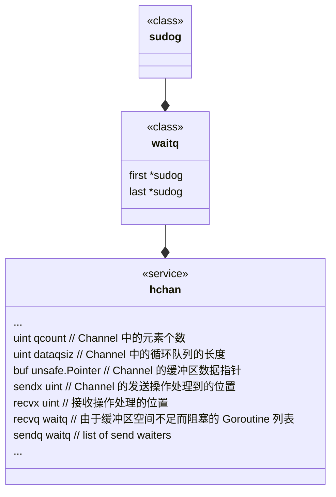
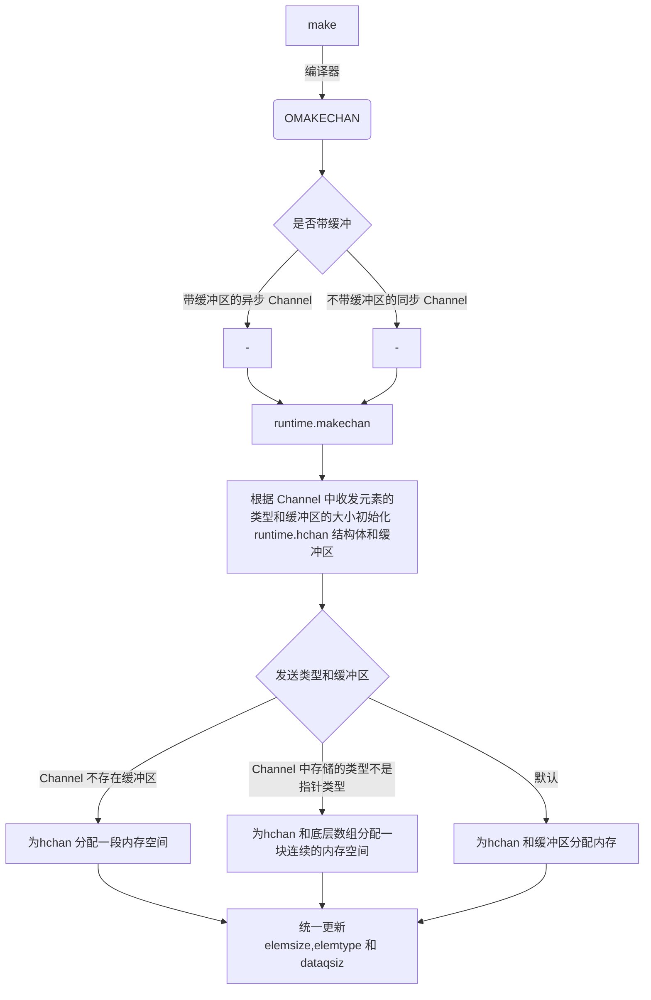
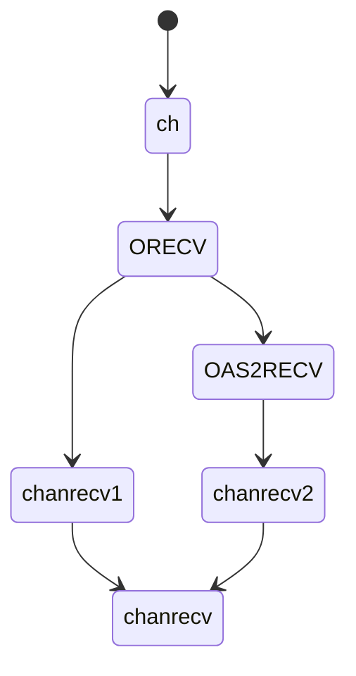

---
# Course title, summary, and position.
linktitle: golang 并发编程 
summary: 并发编程 Channel
weight: 2

# Page metadata.
title: Channel
date: "2018-09-09T00:00:00Z"
lastmod: "2018-09-09T00:00:00Z"
draft: false  # Is this a draft? true/false
toc: true  # Show table of contents? true/false
type: docs  # Do not modify.

# Add menu entry to sidebar.
# - name: Declare this menu item as a parent with ID `name`.
# - weight: Position of link in menu.
menu:
  chapter3:
    name: channel
    weight: 3
---


## 目标

- channel 的设计目标和设计原则
- channel 的数据结构
- channel 的数据收发逻辑
- 总结

## channel 的设计目标和设计原则

### 设计目标

channel 本质上是一个高性能的无锁缓存管道。通过通信的方式，解决多个goroutine 之间的数据共享问题。

      不要通过共享内存的方式进行通信，而是应该通过通信的方式共享内存

既然是内存channel，需要解决如下的问题：
-  数据的有序性，FIFO
-  性能，多个Goroutine 向同一个channel 收发数据时**锁和调度的优化**


### 设计原则 -FIFO

多个Goroutine 向同一个channel 收发数据的原则**先进先出**
- 先从 Channel 读取数据的 Goroutine 会先接收到数据；
- 先向 Channel 发送数据的 Goroutine 会得到先发送数据的权利；

但是 Go 语言稍早版本的实现却不是严格遵循这一语义的，[runtime: make sure blocked channels run operations in FIFO order](https://github.com/golang/go/issues/11506),中提出了有缓冲区的 Channel 在执行收发操作时没有遵循 FIFO 的规则,带缓冲区的channel 读写机制，

- 发送方会向缓冲区中写入数据，然后唤醒接收方，多个接收方会尝试从缓冲区中读取数据，如果没有读取到就会重新陷入休眠；
- 接收方会从缓冲区中读取数据，然后唤醒发送方，发送方会尝试向缓冲区写入数据，如果缓冲区已满就会重新陷入休眠；

这种基于重试的机制会导致 Channel 的处理不会遵循 FIFO 的原则。经过 [runtime: simplify buffered channels](https://github.com/golang/go/commit/8e496f1d6923172291658f0a785bdb47cc152325) 和 [runtime: simplify chan ops, take 2](https://github.com/golang/go/commit/e410a527b208e0a9acd0cded3775b302d8f2b00a) 两个提交的修改，带缓冲区和不带缓冲区的 Channel 都会遵循先入先出对数据进行接收和发送3 4。

### 设计原则-锁优化

一般来说，会通过 CAS(compare-and-swap 或者 compare-and-set)自旋锁的操作,来实现无锁队列。

从本质上来说，Channel 是一个用于同步和通信的有锁队列，使用互斥锁解决程序中可能存在的线程竞争问题是很常见的，我们能很容易地实现有锁队列。但锁导致的休眠和唤醒会带来额外的上下文切换。

1994 年的论文 [Implementing lock-free queues](http://people.cs.pitt.edu/~jacklange/teaching/cs2510-f12/papers/implementing_lock_free.pdf) 就研究了如何使用无锁的数据结构实现先进先出队列，而 Go 语言社区也在2014 年提出了无锁 Channel 的实现方案，该方案将 Channel 分成了以下三种类型8：

- 同步 Channel — 不需要缓冲区，发送方会直接将数据交给（Handoff）接收方；
- 异步 Channel — 基于环形缓存的传统生产者消费者模型；
- chan struct{} 类型的异步 Channel — struct{} 类型不占用内存空间，不需要实现缓冲区和直接发送（Handoff）的语义；


这个提案的目的也不是实现完全无锁的队列，只是在一些关键路径上通过无锁提升 Channel 的性能。社区中已经有无锁 Channel 的实现9，但是在实际的基准测试中，无锁队列在多核测试中的表现还需要进一步的改进10。

因为目前通过 CAS 实现11的无锁 Channel 没有提供 FIFO 的特性，所以该提案暂时也被搁浅了12。


## channel 的数据结构


### channel 数据结构





```
type hchan struct {
	qcount   uint           // total data in the queue
	dataqsiz uint           // size of the circular queue
	buf      unsafe.Pointer // points to an array of dataqsiz elements
	elemsize uint16 //当前 Channel 能够收发的元素的大小
	elemtype *_type // element type  //当前 Channel 能够收发的元素的类型
	sendx    uint   // send index
	recvx    uint   // receive index
	recvq    waitq  // list of recv waiters
	sendq    waitq  // list of send waiters
      closed   uint32

	// lock protects all fields in hchan, as well as several
	// fields in sudogs blocked on this channel.
	//
	// Do not change another G's status while holding this lock
	// (in particular, do not ready a G), as this can deadlock
	// with stack shrinking.
	lock mutex
}
```


hchan 是实现channel 的数据结构，包括一个环形buffer队列，该buffer 大小，收发元素对应的操作位置，以及channel的
元素类型和大小。 
sendq 和 recvq 存储了当前 Channel 由于缓冲区空间不足而阻塞的 Goroutine 列表，这些等待队列使用双向链表 runtime.waitq 表示,

```
type waitq struct {
	first *sudog
	last  *sudog
}
```

sudog 代表了在某个channel 上收发数据而处于等待的goroutine。

sudog 是为了解决 goroutine 和 同步对象之间多对多的关系，而抽象出的概念。 一个因此一个goroutine可能在多个等待列表中，
因此一个goroutine 对应多个 sudogs, 多个goroutine 可能等待同一个同步对象，因此，也会存在多个 sudog 对应
一个对象。
sudog 通过一个特殊池来分配. 通过 acquireSudog 和 releaseSudog 来分配和释放。


### channel 初始化

Channel 的创建都会使用 make 关键字，编译器会将 make(chan int, 10) 表达式被转换成 OMAKE 类型的节点，并在类型检查阶段将 OMAKE 类型的节点转换成 OMAKECHAN 类型
根据 Channel 中收发元素的类型和缓冲区的大小初始化 runtime.hchan 结构体和缓冲区：


上述代码根据 Channel 中收发元素的类型和缓冲区的大小初始化 runtime.hchan 结构体和缓冲区：

如果当前 Channel 中不存在缓冲区，那么就只会为 runtime.hchan 分配一段内存空间；
如果当前 Channel 中存储的类型不是指针类型，就会为当前的 Channel 和底层的数组分配一块连续的内存空间；
在默认情况下会单独为 runtime.hchan 和缓冲区分配内存；
在函数的最后会统一更新 runtime.hchan 的 elemsize、elemtype 和 dataqsiz 几个字段





## channel 的数据发送

使用 ch <- i 语句，编译器会将它解析成 OSEND 节点并在 [cmd/compile/internal/gc.walkexpr]() 函数中转换成 
runtime.chansend1：

chansend1 会调用runtime.chansend 并传入Channel 和需要发送的数据。runtime.chansend 是向 Channel 中发送数据时最终会调用的函数，这个函数负责了发送数据的全部逻辑，如果我们在调用时将 block 参数设置成 true，那么就表示当前发送操作是一个阻塞操作：
```

func chansend(c *hchan, ep unsafe.Pointer, block bool, callerpc uintptr) bool {
	lock(&c.lock)

	if c.closed != 0 {
		unlock(&c.lock)
		panic(plainError("send on closed channel"))
	}

```

在发送数据的逻辑执行之前会先为当前 Channel 加锁，防止发生竞争条件。如果 Channel 已经关闭，那么向该 Channel 发送数据时就会报"send on closed channel" 错误并中止程序。


### 直接发送

如果目标 Channel 没有被关闭并且已经有处于读等待的 Goroutine，那么 runtime.chansend 函数会从接收队列 recvq 中取出最先陷入等待的 Goroutine 并直接向它发送数据：

```
if sg := c.recvq.dequeue(); sg != nil {
		send(c, sg, ep, func() { unlock(&c.lock) }, 3)
		return true
}

```


发送数据时会调用 runtime.send，该函数的执行可以分成两个部分：

1. 调用 runtime.sendDirect 函数将发送的数据直接拷贝到 x = <-c 表达式中变量 x 所在的内存地址上；

2. 调用 runtime.goready 将等待接收数据的 Goroutine 标记成可运行状态 Grunnable 并把该 Goroutine 放到发送方所在的处理器的 runnext 上等待执行，该处理器在下一次调度时就会立刻唤醒数据的接收方；

```
// send processes a send operation on an empty channel c.
// The value ep sent by the sender is copied to the receiver sg.
// The receiver is then woken up to go on its merry way.
// Channel c must be empty and locked.  send unlocks c with unlockf.
// sg must already be dequeued from c.
// ep must be non-nil and point to the heap or the caller's stack.
func send(c *hchan, sg *sudog, ep unsafe.Pointer, unlockf func(), skip int) {
	...
	if sg.elem != nil {
		sendDirect(c.elemtype, sg, ep)  
		sg.elem = nil
	}
	gp := sg.g
	unlockf()
	gp.param = unsafe.Pointer(sg)
	if sg.releasetime != 0 {
		sg.releasetime = cputicks()
	}
	goready(gp, skip+1)
}
```


### 缓冲区

如果创建的 Channel 包含缓冲区并且 Channel 中的数据没有装满，就会执行下面这段代码

```

...
if c.qcount < c.dataqsiz {
		// Space is available in the channel buffer. Enqueue the element to send.
		qp := chanbuf(c, c.sendx)
		if raceenabled {
			raceacquire(qp)
			racerelease(qp)
		}

		typedmemmove(c.elemtype, qp, ep)

		c.sendx++

    // 如果发送处理位置到达达到处理元素的最大值，就置为零，环形Buffer
		if c.sendx == c.dataqsiz {
			c.sendx = 0
		}

		c.qcount++

		unlock(&c.lock)
		return true
	}

...

```

首先会使用 chanbuf 计算出下一个可以存储数据的位置，然后通过 runtime.typedmemmove 将发送的数据拷贝到缓冲区中并增加 sendx 索引和 qcount 计数器。


### 阻塞发送

当 Channel 没有接收者能够处理数据时，向 Channel 发送数据就会被下游阻塞，当然使用 select 关键字可以向 Channel 非阻塞地发送消息。向 Channel 阻塞地发送数据会执行下面的代码，我们可以简单梳理一下这段代码的逻辑：

```
func chansend(c *hchan, ep unsafe.Pointer, block bool, callerpc uintptr) bool {
	...
	if !block {
		unlock(&c.lock)
		return false
	}
  //调用 runtime.getg 获取发送数据使用的 Goroutine；
	gp := getg()

	mysg := acquireSudog()
	mysg.elem = ep
	mysg.g = gp
	mysg.c = c
	gp.waiting = mysg
	c.sendq.enqueue(mysg)
	goparkunlock(&c.lock, waitReasonChanSend, traceEvGoBlockSend, 3)

	gp.waiting = nil
	gp.param = nil
	mysg.c = nil
	releaseSudog(mysg)
	return true
}

```


### 小结

1. 调用时将 block 参数设置成 true，那么就表示当前发送操作是一个阻塞操作

2. 在发送数据的逻辑执行之前会先为当前 Channel 加锁，防止发生竞争条件,
如果 Channel 已经关闭，那么向该 Channel 发送数据时就会报"send on closed channel" 错误并中止程序

3. 如果当前 Channel 的 recvq 上存在已经被阻塞的 Goroutine，那么会直接将数据发送给当前的 Goroutine 并将其设置成下一个运行的 Goroutine；

4. 如果 Channel 存在缓冲区并且其中还有空闲的容量，我们就会直接将数据直接存储到当前缓冲区 sendx 所在的位置上；

5. 如果不满足上面的两种情况，就会创建一个 runtime.sudog 结构并将其加入 Channel 的 sendq 队列中，当前 Goroutine 也会陷入阻塞等待其他的协程从 Channel 接收数据；

发送数据的过程中包含几个会触发 Goroutine 调度的时机：
1. 发送数据时发现 Channel 上存在等待接收数据的 Goroutine，立刻设置处理器的 runnext 属性，但是并不会立刻触发调度；
2. 发送数据时并没有找到接收方并且缓冲区已经满了，这时就会将自己加入 Channel 的 sendq 队列并调用 runtime.goparkunlock 触发 Goroutine 的调度让出处理器的使用权；


## channel 的数据接收逻辑

Go 语言中可以使用两种不同的方式去接收 Channel 中的数据：

```
i <- ch
i, ok <- ch
```
这两种不同的方法经过编译器的处理都会变成 ORECV 类型的节点，后者会在类型检查阶段被转换成 OAS2RECV 类型。数据的接收操作遵循以下的路线图：



虽然不同的接收方式会被转换成 runtime.chanrecv1 和 runtime.chanrecv2 两种不同函数的调用，但是这两个函数最终还是会调用 runtime.chanrecv。


### 小结

我们梳理一下从 Channel 中接收数据时可能会发生的五种情况：

如果 Channel 为空，那么就会直接调用 runtime.gopark 挂起当前 Goroutine；
如果 Channel 已经关闭并且缓冲区没有任何数据，runtime.chanrecv 函数会直接返回；
如果 Channel 的 sendq 队列中存在挂起的 Goroutine，就会将 recvx 索引所在的数据拷贝到接收变量所在的内存空间上并将 sendq 队列中 Goroutine 的数据拷贝到缓冲区；
如果 Channel 的缓冲区中包含数据就会直接读取 recvx 索引对应的数据；
在默认情况下会挂起当前的 Goroutine，将 runtime.sudog 结构加入 recvq 队列并陷入休眠等待调度器的唤醒；

我们总结一下从 Channel 接收数据时，会触发 Goroutine 调度的两个时机：
1. 当 Channel 为空时；
2. 当缓冲区中不存在数据并且也不存在数据的发送者时；


## 总结


## 参考文献


[Dmitry Vyukov. Jan, 2014. “Go channels on steroids” ](https://docs.google.com/document/d/1yIAYmbvL3JxOKOjuCyon7JhW4cSv1wy5hC0ApeGMV9s/pub) 

[Ahmed W. A scalable lock-free channel.](https://github.com/OneOfOne/lfchan/blob/master/lfchan.go)

[8 Dmitry Vyukov. Jan, 2014. “Go channels on steroids”](https://docs.google.com/document/d/1yIAYmbvL3JxOKOjuCyon7JhW4cSv1wy5hC0ApeGMV9s/pub)

[9 Ahmed W. A scalable lock-free channel.](https://github.com/OneOfOne/lfchan/blob/master/lfchan.go)