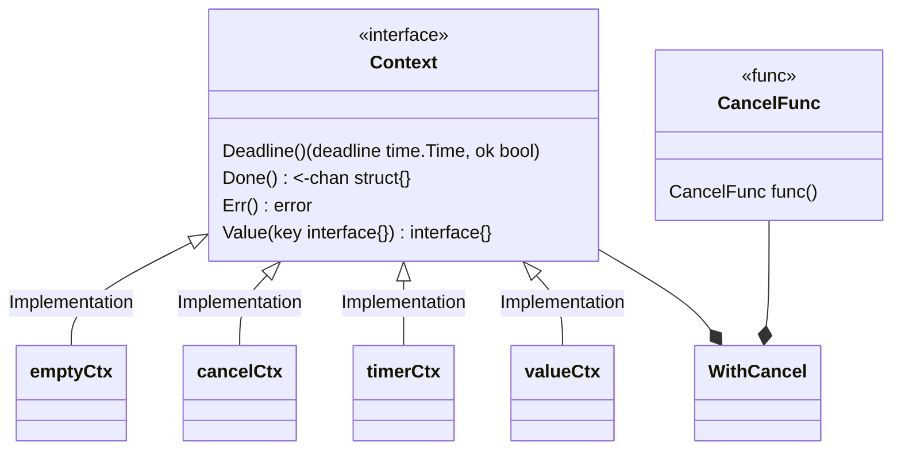

---
# Course title, summary, and position.
linktitle: golang 并发编程 
summary: 并发编程 Context
weight: 1

# Page metadata.
title: Contex详解
date: "2018-09-09T00:00:00Z"
lastmod: "2018-09-09T00:00:00Z"
draft: false  # Is this a draft? true/false
toc: true  # Show table of contents? true/false
type: docs  # Do not modify.

# Add menu entry to sidebar.
# - name: Declare this menu item as a parent with ID `name`.
# - weight: Position of link in menu.
menu:
  context:
    name: Contex详解
    weight: 2
---


## Context 的设计背景及原则

### 服务端处理请求逻辑

在Go服务端，每个传入的请求被一个自己的goroutine 处理。 请求处理器通常会开启额外的 goroutine 来访问后端服务
比如 database 或 RPC服务。每个请求的 goroutine 集合通常需要访问该请求特定的信息，比如用户的ID，授权token
以及 请求的 deadline. 当请求被取消或超时时，这个请求对应的goroutine 集能快速退出，系统可以回收它们使用的所有资源。


### 流水线工作模式


### 使用原则

- 不要将Context 存储到一个结构体中，而应该是通过函数传参的方式传递。Context 应该当作第一个参数

- 不要传递一个空的 context 。当你不知道该传递何种Context时候，可以用 context.TODO

- 仅对传输进程和API的请求范围的数据使用上下文值，而不是将可选参数传递给函数。

- 相同的Context 可以传递给不同 goroutine中的函数，Context 对于多个goroutine同时使用是安全的。


## Context 实现

### Context 的类图结构



### Context 接口申明

```
// A Context carries a deadline, a cancellation signal, and other values across
// API boundaries.
//
// Context's methods may be called by multiple goroutines simultaneously.
type Context interface {
	// Deadline returns the time when work done on behalf of this context
	// should be canceled. 
  // Deadline returns ok==false when no deadline is set. 
  // Successive calls to Deadline return the same results.
	Deadline() (deadline time.Time, ok bool)

	// Done returns a channel that's closed when work done on behalf of this
	// context should be canceled. Done may return nil if this context can
	// never be canceled. Successive calls to Done return the same value.
	// The close of the Done channel may happen asynchronously,
	// after the cancel function returns.
	//
	// WithCancel arranges for Done to be closed when cancel is called;
	// WithDeadline arranges for Done to be closed when the deadline expires; 
  // WithTimeout arranges for Done to be closed when the timeout elapses.

	// Done is provided for use in select statements:
	Done() <-chan struct{}

	// If Done is not yet closed, Err returns nil.
	// If Done is closed, Err returns a non-nil error explaining why:
	// Canceled if the context was canceled
	// or DeadlineExceeded if the context's deadline passed.
	// After Err returns a non-nil error, successive calls to Err return the same error.
	Err() error

	// Value returns the value associated with this context for key, or nil
	// if no value is associated with key. Successive calls to Value with
	// the same key returns the same result.
	Value(key interface{}) interface{}
}

```


### 接口分析

```
// Done is provided for use in select statements:
Done() <-chan struct{}
```

Done 方法返回一个 struct{} chan , 该 channel 扮演了一个代表 context 运行函数的取消信号。
当该channel 关闭时，相应的函数应该放弃对应的工作并返回。

Context 并不提供Cancel 方法，这和Done channel 只能被动接受的原因相同。 接受取消信号的函数，通常并不是
发送 cancel 信号 函数。尤其是,当一个父操作为子操作开启新的 goroutine 时，子操作不能取消父操作。

```
Err() error
```
Err 函数会返回一个错误提示，为什么当前的context 被取消。


```
Deadline() (deadline time.Time, ok bool)
```

Deadline 方法允许函数判断，是否值得开始工作。如果所剩的时间比较少，就不值得开启工作。在编码中，
也可以用用于设置I/O操作的超时时间


```
Value(key interface{}) interface{}
```

Value  函数，允许上下文携带请求范围的数据。这些数据可以被多个子 goroutine 线程安全的访问。
 


### Context 的派生接口介绍

为了便于使用，Context 包提供了几个派生的Context，他们提供了Context语意，和一个 CancelFunc的回调函数。
当上下文被取消时，从它派生的所有上下文也将被取消。 函数原型如下：

```

// A CancelFunc tells an operation to abandon its work.
// A CancelFunc does not wait for the work to stop.
// A CancelFunc may be called by multiple goroutines simultaneously.
type CancelFunc func()


WithCancel(parent Context) (ctx Context, cancel CancelFunc)

WithDeadline(parent Context, d time.Time) (Context, CancelFunc)

WithTimeout(parent Context, timeout time.Duration) (Context, CancelFunc)

```

这几个函数，都接受一个上下文（parent Context)，并返回一个派生的上下文，和一个CancelFunc。调用CancelFunc将
触发以下操作：

* 取消输入context 派生的子context，以及该子context 派生的子孙 context
* 删除父对象对子对象的引用
* 停止任何关联的计时器。


## Context 实现原理分析


## Context 典型的使用场景，举例分析


### Http 请求的场景

如下代码，模拟了一个一个HTTP Server 服务，处理客户端请求需要2秒时间，若在两秒内，用户取消了请求，
该请求应该立刻被返回。

```

func main() {
	// Create an HTTP server that listens on port 8000
	http.ListenAndServe(":8000", http.HandlerFunc(func(w http.ResponseWriter, r *http.Request) {
		ctx := r.Context()
		// This prints to STDOUT to show that processing has started
		fmt.Fprint(os.Stdout, "processing request\n")
		// We use `select` to execute a peice of code depending on which
		// channel receives a message first
		select {
		case <-time.After(2 * time.Second):
			// If we receive a message after 2 seconds
			// that means the request has been processed
			// We then write this as the response
			w.Write([]byte("request processed"))
		case <-ctx.Done():
			// If the request gets cancelled, log it
			// to STDERR
			fmt.Fprint(os.Stderr, "request cancelled\n")
		}
	}))
}

```
可以通过在2秒内关闭浏览器模拟取消请求，在控制台上就能看到 request cancelled 的输出。完整的代码在[这里](https://github.com/sohamkamani/blog-example-go-context-cancellation)。


### 主动提交一个取消事件

在某些场景下，如果我们希望在满足特定条件下取消一个任务，可以通过提交一个cancel事件来实现。
下面的例子，展示这种场景

```

func operation1(ctx context.Context) error {
	time.Sleep(100 * time.Millisecond)
	return errors.New("failed")
}

func operation2(ctx context.Context) {
	select {
	case <-time.After(500 * time.Millisecond):
		fmt.Println("done")
	case <-ctx.Done():
		fmt.Println("halted operation2")
	}
}

func main() {
  ctx :=context.Background()
  ctx, cancel :=context.WithCancel(ctx)
  go func(){
    err :=Operation1(ctx)
    if err != nil {
      cancel()
    }
  }()
  operation2(ctx)
}


```

例子2，带有超时时间的context。

```
func main() {
	ctx, cancel := context.WithTimeout(context.Background(), 1*time.Second)
	defer cancel()
	go handle(ctx, 500*time.Millisecond)
	select {
	case <-ctx.Done():
		fmt.Println("main", ctx.Err())
	}
}

func handle(ctx context.Context, duration time.Duration) {
	select {
	case <-ctx.Done():
		fmt.Println("handle", ctx.Err())
	case <-time.After(duration):
		fmt.Println("process request with", duration)
	}
}

```


### 一个容易犯错的例子

```

func doSomething() {
	ctx, cancel := context.WithCancel(ctx)
	defer cancel()

	someArg := "loremipsum"
	go doSomethingElse(context.Background(), someArg)
}

```

doSomething 函数退出时，就会调用cancel(),此时，doSomething 会被迫终止，
在函数中调用另一个子进程时，应创建一个新的context


### Pipline 的场景

所谓的Pipline 可以理解为： 通过channel 连在一起的一系列的状态，每个状态都有
一组goroutine 执行相同的函数。在每个阶段，这些 goroutine 执行如下操作：

* 从上游接受channel 获取值
* 对获取的数据执行一些操作，
* 将数据通过传出 channels下发

通过一个例子来说明：

生成函数

```
func gen(nums ...int) <-chan int {
    out := make(chan int)
    go func() {
        for _, n := range nums {
            out <- n
        }
        close(out)
    }()
    return out
}
```


## Context 总结


## 扩展阅读

[Go Concurrency Patterns: Pipelines and cancellation](https://blog.golang.org/pipelines)