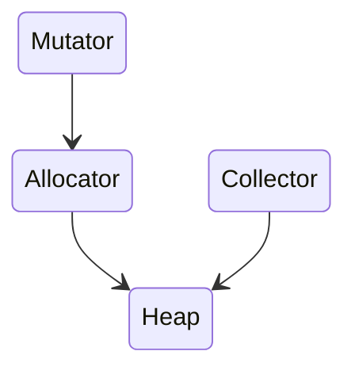
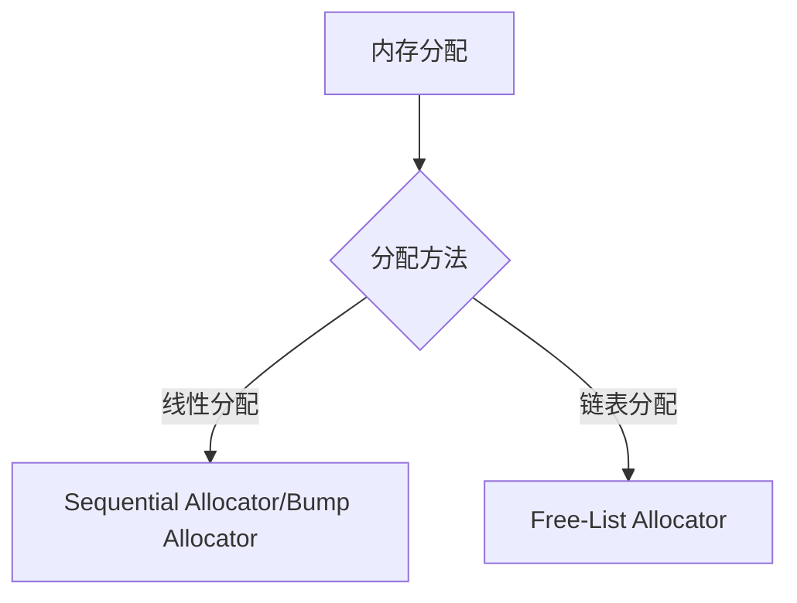

---
# Course title, summary, and position.
linktitle: 概览
summary: 概览
weight: 2

# Page metadata.
title: 概览
date: "2018-09-09T00:00:00Z"
lastmod: "2018-09-09T00:00:00Z"
draft: false  # Is this a draft? true/false
toc: true  # Show table of contents? true/false
type: docs  # Do not modify.

# Add menu entry to sidebar.
# - name: Declare this menu item as a parent with ID `name`.
# - weight: Position of link in menu.
menu:
  chapter7:
    name: 内存管理
    weight: 2
---

## 概览

程序中的数据和变量都会被分配到程序所在的虚拟内存中，内存空间包含两个重要区域 — 栈区（Stack）和堆区（Heap）

函数调用的参数、返回值以及局部变量大都会被分配到栈上，这部分内存会由编译器进行管理；

堆中的对象由内存分配器分配并由垃圾收集器回收。

## 设计原理

内存管理一般包含三个不同的组件，分别是用户程序（Mutator）、分配器（Allocator）和收集器（Collector）[1](##参考文献),当用户程序申请内存时，它会通过内存分配器申请新的内存，而分配器会负责从堆中初始化相应的内存区域。

## 目标

了解内存分配器的分配方法以及Go语言内存分配器的分级分配方法，虚拟内存布局和地址空间

### 分配方法

## 参考文献

[1. Dmitry Soshnikov. Feb 2019. “Writing a Memory Allocator”](http://dmitrysoshnikov.com/compilers/writing-a-memory-allocator/)