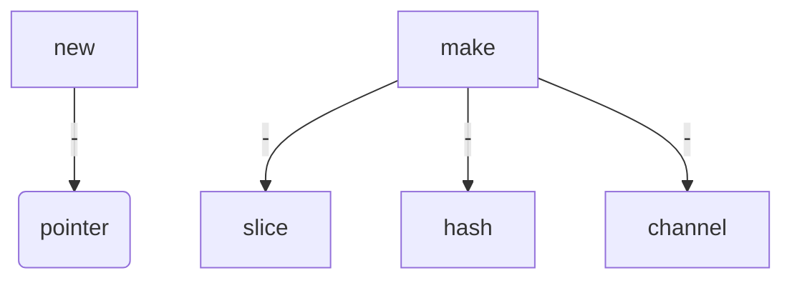

---
# Course title, summary, and position.
linktitle: Golang学习笔记
summary: Golang Pointer
weight: 1

# Page metadata.
title: GolangStudy
date: "2018-09-09T00:00:00Z"
lastmod: "2018-09-09T00:00:00Z"
draft: false  # Is this a draft? true/false
toc: true  # Show table of contents? true/false
type: docs  # Do not modify.

# Add menu entry to sidebar.
# - name: Declare this menu item as a parent with ID `name`.
# - weight: Position of link in menu.
menu:
  golangpointer:
    name: OverView
    weight: 1
---

# golang 指针

## 指针的基本概念

- 指针地址
- 指针类型

## Go语言中指针的特点

Go语言为程序员提供了控制数据结构指针的能力，但是，并**不能进行指针运算**。

### 为什么不能进行指针运算？

1. 指针类型变量即拥有指针高效访问的特点，又不会发生指针偏移，从而避免了非法修改关键性数据的问题。

2. 垃圾回收也比较容易对不会发生偏移的指针进行检索和回收。

### 指针的核心概念

指针（pointer）在Go语言中可以被拆分为两个核心概念：

* 类型指针，允许对这个指针类型的数据进行修改，传递数据可以直接使用指针，而无须拷贝数据，**类型指针不能进行偏移和运算。**

* 切片，由**指向起始元素的原始指针、元素数量和容量组成**。

      切片比原始指针具备更强大的特性，而且更为安全。切片在发生越界时，运行时会panic，并打出堆栈，而原
      始指针只会崩溃。

## GO 中的指针地址和指针类型

Go语言中使用在变量名前面添加&操作符（前缀）来获取变量的内存地址（取地址操作）

```
ptr :=&V // V 类型为T

其中 v 代表被取地址的变量，变量 v 的地址使用变量 ptr 进行接收，ptr 的类型为*T，称做 T 的指针类型，*代表指针。

```


## golang 的关键字 make 和 new 


- make 的作用是 初始化内置的数据结构，slice,map,channel [1](https://golang.org/doc/effective_go.html#allocation_make)

- new  的作用是 根据传入的类型，分配一片内存空间，并返回指向这篇内存空间的指针[2](https://golang.org/doc/effective_go.html#allocation_new)


### new 关键字

先看 new 这个关键字，new 是一个内置的内存分配函数，区别与其它语言的 new, 它不初始化内存，只将其归零。也就是说，new（T）为类型为T的新项分配 zeroed storage 并返回其地址，即类型为 *T 的值。在go 中，它返回指向新分配的类型为T的零值的指针。

```

It's a built-in function that allocates memory, but unlike its namesakes in some 
other languages it does not initialize the memory, it only zeros it. That is, 
new(T) allocates zeroed storage for a new item of type T and returns its address,
a value of type *T. In Go terminology, it returns a pointer to a newly allocated 
zero value of type T.

Since the memory returned by new is zeroed, it's helpful to arrange when designing 
your data structures that the zero value of each type can be used without further 
initialization. This means a user of the data structure can create one with new and
 get right to work. For example, the documentation for bytes.Buffer states that 
 "the zero value for Buffer is an empty buffer ready to use." Similarly, sync.Mutex 
 does not have an explicit constructor or Init method. Instead, the zero value 
 for a sync.Mutex is defined to be an unlocked mutex.

```

举例：

The zero-value-is-useful property works transitively,

```

type SyncedBuffer struct {
    lock    sync.Mutex
    buffer  bytes.Buffer
}

```
类型为 SyncedBuffer 的值 分配完，或申明完就可以立即使用，并不需要进一步的初始化

```

p := new(SyncedBuffer)  // type *SyncedBuffer
var v SyncedBuffer      // type  SyncedBuffer

```


### 比较在C语言中的临时变量和GO语言中的临时变量指针

在C语言中，如下的写法

```
#include <stdio.h>

int *fun() //指针函数 （返回值是一个地址）
{
	int a = 10;
	return &a;  //返回变量a的地址
}

int main()
{
	int *b = NULL;
	b = fun();
	printf("%d\n", *b);
}
编译时会有警告：
main.c:14:12: warning: function returns address of local variable [-Wreturn-local-addr]
$ ./a.out 
Segmentation fault (core dumped) //运行发生段错误

```

在 go 语言中，

```
package main
import (
    "fmt"
)
func  fun() *int {
	a := 10;
	return &a;  //返回变量a的地址
}
func main() {
    b :=fun()
    fmt.Printf("%T,%p %d\n", b,b, *b)
}
go run a.go

*int,0xc000018078 10
输出b 的类型为指针，内存地址为：0xc000018078,存储的值为10

```

new 和 make 关键字的区别




### 构造器和符合语句（Constructors and composite literals ）

某些情况下，0值并不是我们想要的，如下例子：

```
func NewFile(fd int, name string) *File {
    if fd < 0 {
        return nil
    }
    f := new(File)
    f.fd = fd
    f.name = name
    f.dirinfo = nil
    f.nepipe = 0
    return f
}
```
我们可以通过复合语句(composite literals)简化，

```
func NewFile(fd int, name string) *File {
    if fd < 0 {
        return nil
    }
    f := File{fd, name, nil, 0}
    return &f
}

```
上述例子，我们返回了一个临时变量，这个临时变量在函数返回后，在内存中的值依然存在。以上的语句可以进一步简化；

```

return &File{fd, name, nil, 0}

```

复合文本的字段按顺序排列，并且必须全部存在。但是，通过将元素显式标记为字段：值对，初始值设定项可以按任意顺序显示，缺少的值保留为各自的零值。所以可以进一步简化：

```
return &File{fd: fd, name: name}

```
如何复合构造的语句不包含 属性字段创建一个0值的类型指针，那么

    new(File) 和 &File{} 

两种表达方式是等效的。


## make 关键字

内置函数 make (T , args) 和 new(T) 不同。make 只能创建 slices , map ,channel， make 会返回一个初始化
的类型为T的值（而非0值）。 这个区别的根本原因在于，这三种类型的数据结构，在使用前必须被初始化。


## Pointer vs Values

对比分析如下两个函数定义，请解释他们的区别:

```
// 定义一个新的 []byte 类型,
type ByteSlice []byte

// 绑定对应的Append函数，
func (slice ByteSlice) Append(data []byte) []byte {
    ...
}

// 通过重新定义方法，将指向ByteSlice的指针作为其接收器来消除这种笨拙，这样方法就可以覆盖调用方的切片。
func (p *ByteSlice) Append(data []byte) {
    slice := *p
    // Body as above, without the return.
    *p = slice
    ...
}
```
第一步，我们提供值传递的方法，构造了Append函数，但需要将 更新后的 slice返回，
第二个函数，将值传递转化为指针，这样可以直接对传入的slice进行修改，从而省掉返回值
其实，我们可以跟进一步，修改一些这个函数，为如下形式：

```
func (p *ByteSlice) Write(data []byte) (n int, err error) {
    slice := *p
    // Again as above.
    *p = slice
    return len(data), nil
}

```
类型 *ByteSlice, 符合标准的 io.Writer接口。因此可以直接输出

```
var b ByteSlice
fmt.Fprintf(&b, "This hour has %d days\n", 7)

```
由于只有 *ByteSlice 满足 io.Writer， 因此我们传递 ByteSlice 的地址，(即: &b),

指针和值的区别在于，值传递的方法，能被指针和值调用，但指针的方法，只能被指针类调用。
出现此规则的原因是：指针方法可以修改接收器；对值调用他们将


## 参考阅读

[allocation_new](https://golang.org/doc/effective_go.html#allocation_new)

[allocation_make](https://golang.org/doc/effective_go.html#allocation_make)


