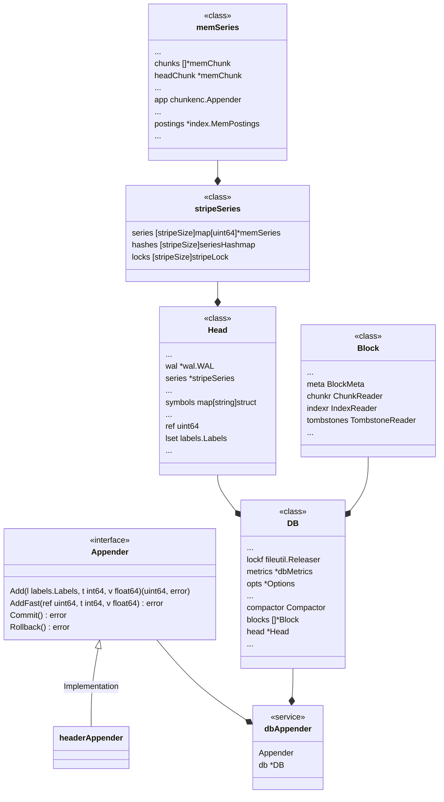
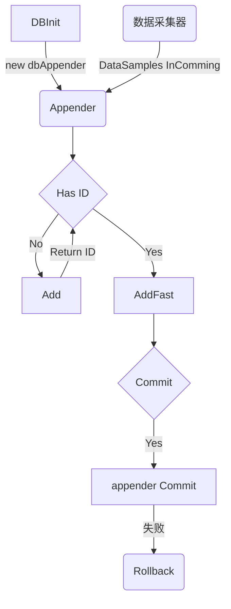
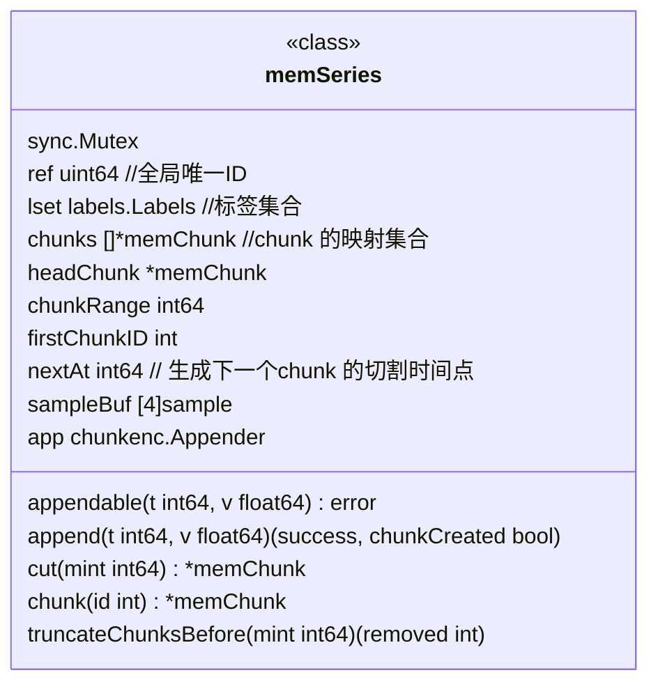
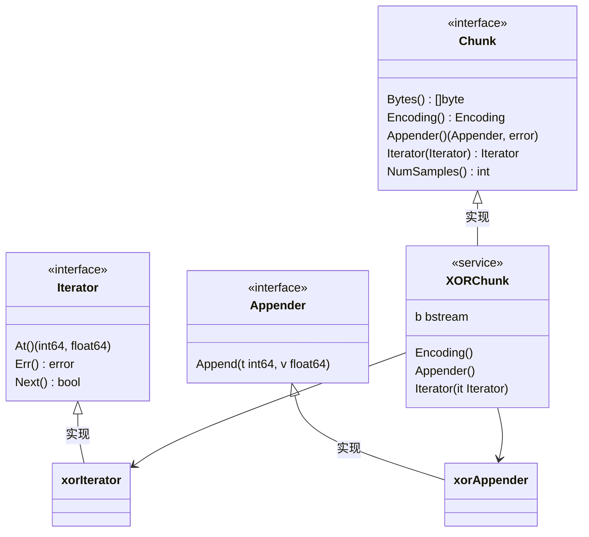
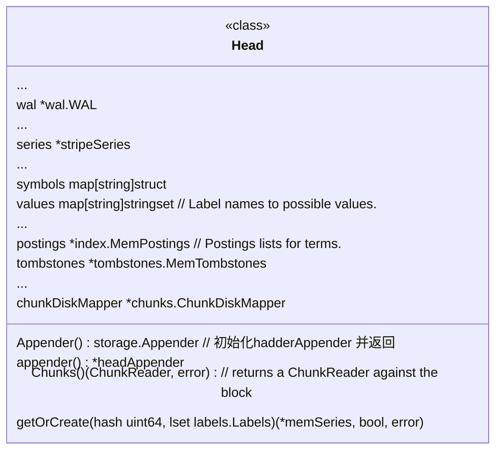
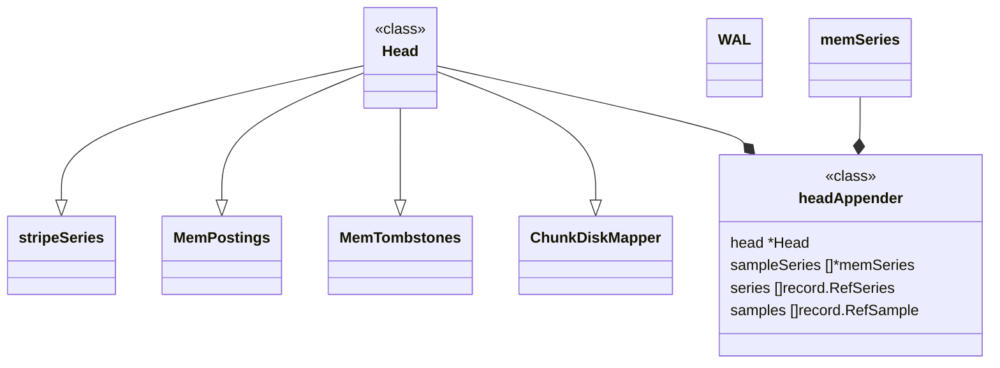
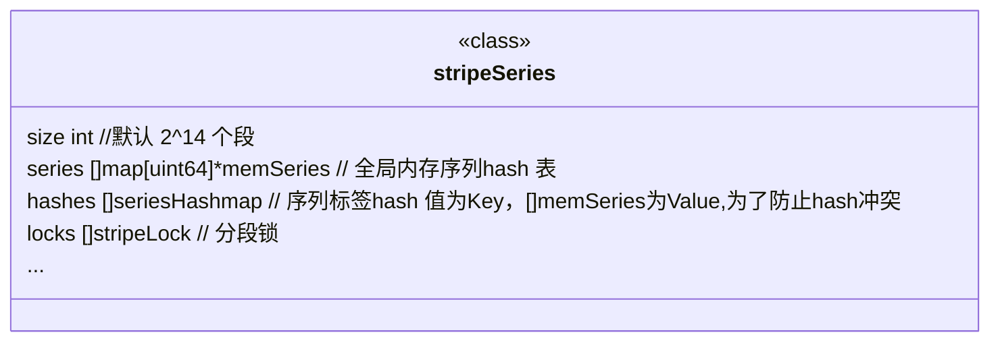

## 目标
- 核心类图
- 设计思路分析
- 客户端视角-数据的写入流程
- DB初始化流程
- 关键内存对象分析
- 总结


## 核心类图




## 设计思路分析

Appender 实现对时间序列采样数据写操作的抽象和封装，提供Add/AddFast/Commit/Rollback的核心能力

通过DB 这个类，实现对落在某个时间窗口内的时间序列数据的读写操作。
通过 DB + Appender 的组合，就能提供时序数据库的写入逻辑，
可以通过 BD + Query 的组合，完成时间序列数据库的读逻辑。
可以看到，系统的顶层设计非常优秀，秉持了高内聚，低耦合的原则。


DB内部通过Head,Block,Compactor 等关键几个抽象类，完成数据内存模型的的封装。
Head 及其相关的类，实现了时间序列数据在内存中的读写，存储。
Block实现了数据块和磁盘文件目录的映射，而Compactor抽象了数据写入磁盘的逻辑，包括，写入计划，写操作，以及压缩合并。具体是通过 leavelCompactor 实现。

headerAppender 是数据写入内存的主要承担者，通过 stripeSeries 来构建全局序列缓存，通过类似分段Hash 的方式，降低读写锁竞争，提升效率。
单个序列的内存模型是memSeries, 单个序列的数据最终是要落盘的，对应了时间序列数据的真实data的存储，
通过chunk，以及mmapchunk的抽象，实现内存chunk和磁盘chunk的映射，并通过 mmap的机制，实现chunk
数据的懒加载。
对于chunk 的写入，抽象出了 chunk appender ,并通过 XOR chunkappend 的实现类，实现了 gorilla 的
delta of delta 的压缩算法，完成对数据的压缩存储。而且这部分也是低耦合的，只要我们轻易的增加一个
新的 chunkappend 实现累，就可以做到灵活的切换到其它的压缩算法上去。

数据采样点，在写入内存的同时，会创建一个全局唯一的ID，作为正排索引，提高我们数据查询效率。序列写入的同时，会构建全局的标签键值对的符号表，每个标签对应那些Value，以及 倒排索引。核心的倒排索引数据结构是
*index.MemPostings, 核心的Map结构是一个大的二层Map，

    Map <LabelKey, Map <LabelValue,[]IDs>>

第一层Map的键是序列中的标签名称，第二层的Map 的键是 第一层标签对应的Value，而值则是有该标签键，值对
对应的所有的序列ID列表，而且每次更新时，都会保持ID是有序的。

Head 的另一个核心对象是WAL，通过WAL解决了当数据尚未写入磁盘时，宕机引发的数据丢失问题。WAL在appedner Commit的时候被触发，实现了对Append的序列和采样数据的WAL.

## 客户端视角-数据的写入流程

1. 流程图



2. 代码实现

2.1 DB 初始化

```

storage, err := tsdb.Open(dir, l, nil, &tsdb.Options{
		RetentionDuration: 15 * 24 * 60 * 60 * 1000, // 15 days in milliseconds
		BlockRanges:       tsdb.ExponentialBlockRanges(2*60*60*1000, 5, 3),
	})

storage 即一个DB的实例

```

2.2 数据摄入完成，创建一个新的Appender

```
实例化一个 Appender
app := storage.Appender()

// Appender 创建一个新的Appender 实例，这个实例和给定的db 是绑定的
func (db *DB) Appender() Appender {
	return dbAppender{db: db, Appender: db.head.Appender()}
}

```

2.3 写入数据

对于一个新的序列调用 Add, 对于已知的序列，调用AddFast

```
if s.ref == nil {

	  ref, err := app.Add(s.labels, ts, float64(s.value))
         s.ref = &ref

	...
} else {

    app.AddFast(*s.ref, ts, float64(s.value)

    ...

}
```

2.4 提交/回滚

```
app.Commit() Or  app.Rollback()

```

## 服务端视角-DB初始化

```
caller=db.go:571 msg="DBInit 1,打开文件，初始化存储目录,log,Block Ragne等，修复坏的索引版本"
caller=db.go:573 msg="DBInit 2,初始化DB实例"
caller=db.go:575 msg="DBInit 3,监控指标初始化"
caller=db.go:586 msg="DBInit 4,DB 文件加锁"
caller=db.go:599 msg="DBInit 5,创建一个LeveledCompactor"
caller=db.go:609 msg="DBInit 6,Wal Log初始化"
caller=db.go:626 msg="DBInit 7,创建 Head"
caller=db.go:633 msg="DBInit 8,db reload"
caller=db.go:640 msg="DBInit 9,db blocks 初始化，获取最小的有效时间"
caller=db.go:650 msg="DBInit 10,db 核心内存结构Head 初始化"
caller=db.go:660 msg="DBInit 11,启动db主线程"
```
其中，步骤10 最为核心，10中完成了时间序列内存正排，倒排索引数据结构的初始化，让我们进入其中，

```
caller=head.go:646 msg="HeadInit 1，重放磁盘的WAL和磁盘内存可映射chunk（如果有的话)"
caller=head.go:659 msg="HeadInit 1.1，获取WAL的最后一个checkpoint"
caller=head.go:686 msg="HeadInit 1.2，获取WAL的最后一个Segment"
caller=head.go:693 msg="HeadInit 1.3，从最近的checkpoint 回填segment"
caller=head.go:702 msg="HeadInit 1.4，加载WAL"
caller=head.go:713 msg="WAL replay completed" duration=744.825µs

```


## 关键内存对象分析

内存数据对象主要关注两个维度：

-  单个时间序列的数据如何存储和查找？
-  多个数据序列数据如何缓存，倒排索引如何构建？

先看单个时间序列数据模型

### 内存序列对象 memSeries


内存序列的，数据模型如上图，核心的概念是chunk, 提供的append 和 cut 等操作，新的时间采样点数据来后，会append,
等到一定的时间戳口就被cut 或 truncate 。chunk之间通过位数固定的步长，chunkRange,通过chunkID 和chunkRange 可以
非常快速的定位到所需查询的chunk。


### 内存序列对象 chunk



chunk 是对单个序列，在段的时间维度上数据模型的抽象。提供的核心功能是Append 和  Iterator. 其中，XORChunk 实现了
gorila 的数据压缩算法。

在看多个时间序列数据模型

### 内存序列对象 Head

#### Head 的类图结构



#### Head 的核心对象及其关系




#### 各个主要对象的功能分析

headAppender 组合了 内存序列对象(memSeries) 和 Head 对象，并实现了 Appender 接口，是时间序列数据写入逻辑
的核心承载者。
Head 通过 stripeSeries,MemPosting,MemTomstones，以及ChunkDiskMapper 完成以下子功能：

- 全局有序的正排索引 -  stripeSeries





stripeSeries 顾名思义，将序列分成了很多条带，降低锁竞争。 初始化时，默认将序列划分为 2^14 个条带。

对于新增一个数据点，如何将该数据写入到内存中的呢？

根据序列标签集计算Hash -> 根据Hash值到全局Hash表中 (stripeSeries) 获取对应的序列 -> 将数据写入单个
序列内存对象 memSeries 中。


根据序列标签集获取Hash值的计算逻辑如下：


```
// lset.Hash(),基于采样点的所有标签构建Hash值
func (ls Labels) Hash() uint64 {
    b := make([]byte, 0, 1024)
    for _, v := range ls {
        b = append(b, v.Name...)
        b = append(b, sep)
        b = append(b, v.Value...)
        b = append(b, sep)
    }
    return xxhash.Sum64(b)
}

```

根据hash值，获取内存序列


```

s, created, err := a.head.getOrCreate(lset.Hash(), lset)
// 从全局分段序列中获取内存序列
func (h *Head) getOrCreate(hash uint64, lset labels.Labels) (*memSeries, bool, error) {
            ...
        s := h.series.getByHash(hash, lset)
            ...
}

从分段的HashMap中获取对应的内存序列

func (s *stripeSeries) getByHash(hash uint64, lset labels.Labels) *memSeries {

    i := hash & uint64(s.size-1)  // 获取对应stripe位置
    s.locks[i].RLock()  
    series := s.hashes[i].get(hash, lset)
    s.locks[i].RUnlock()

    return series
}


```

由于我们内存的序列范围可能非常大，为了提升效率，降低锁的竞争，将该序列分段，通过一次hash 可以定位到一个较小的区间，为了解决hash 冲突，维护了一个小的hashmap。


- 倒排索引 - MemPostings

倒排索引 MemPostings,是个大的二层Map,标签名称Key，为第一层Map的Key，Value为第二层Map的Key，第二层Map的Value则为包含次标签的序列 ID的一个数组。

简化的数据结构描述:  Map<LabelKey,Map<LabelValue,[]Ids>

正是该倒排索引，解决了组合标签过滤查询时查询效率问题，查询性能从 O（M^N） - >  O( M*N ) 。


```
// MemPostings holds postings list for series ID per label pair.
// They may be written to out of order.
type MemPostings struct {
    mtx     sync.RWMutex
    m       map[string]map[string][]uint64  // 标签名称Key，为第一层Map的Key，Value为第二层Map的Key，第二层Map的Value则为包含次标签的序列 ID的一个数组。
    ordered bool
}

```

为了提升查询效率，数据在写入时，会时刻保持某个标签键值对所在的序列列表 IDs 是有序的。其实现逻辑也很简单，如下：


```

 ...
    // id is the given ID
    list :=append(list,id)
    ...
    for i := len(list) - 1; i >= 1; i-- {
        if list[i] >= list[i-1] {
            break
        }
        list[i], list[i-1] = list[i-1], list[i]
}

```


- 预写日志组件 WAL 
  
  新增的序列，首先会写入内存对象，之后，当 append.Commit 时，会触发WAL写入。后面会有单独章节来分析WAL的实现。
  值得一提的是，WAL针对 head 中的 Series 和 Sample 写Log

- 磁盘到内存的 chunk 映射 - chunkDiskMapper

  chunkDiskMapper 基于 mmap 的技术，实现来磁盘chunk到内存chunk  的映射. Head 的

  ```

  loadMmappedChunks() (map[uint64][]*mmappedChunk, error)

  ```

  方法，实现来数据的初始化。


## 总结

本文，从相对宏观的视角分析了 prometheus tsdb 的内存数据模型。

1 . 整体的设计遵循高内聚，低耦合的方式原则。

基于核心的三大领域模型，DB，Appender ,Query 实现。DB是对数据层封装，Appender 是对数据写入操作抽象，
Query是对数据查询操作抽象。Appender + DB 构成了tsdb 的总体写入框架


2. 内存模型从两个角度看，单个序列数据存储模型由 memSeries 承载，多个序列存储模型有Head ,Block ,TomStone等承载。

3. 数据采样写入时候，构建了正排，索引。

   正向索引基于分段hash 的原理，减少锁竞争，通过二次 hashmap 解决hash冲突。
   每个采样数据写入时，会判断是否为新增，若新增则会为期分配全局唯一的ID
   

3. 数据采样写入时候，同时构建了全局的倒排索引，以及符号表

  倒排索引是一个二层Map表, 结构为 <序列标签名称，<序列标签Value，此标签键值对所在的序列ID列表>>, 其中每个标签键值对对应的ID列表为有序的

  也就录了每个标签可能对应那些Value值。


4. 通过 chunkDiskMapper 实现内存chunk 到磁盘chunk的映射

5. 通过WAL 的技术解决在服务宕机时，部分尚未落入磁盘数据的恢复。

在后面的章节将分析，数据在磁盘的存储布局，以及内存数据到磁盘存的迁移过程。


